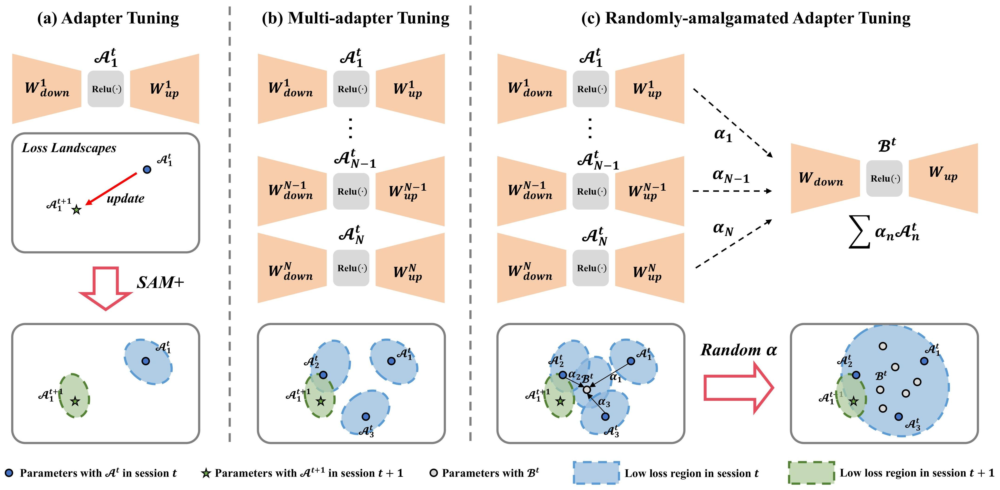
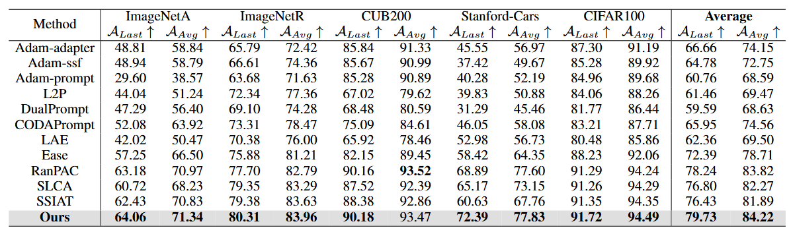

# Random Amalgamation of Adapters for Flatter Loss Landscapes: Towards Class-Incremental Learning with Better Stability
<div align="center">

<div>
    <a href='' target='_blank'>Yao Deng</a>&emsp;
    <a href='https://scholar.google.com.hk/citations?hl=zh-CN&user=-D5k5ioAAAAJ&view_op=list_works' target='_blank'>Xiang Xiang</a>&emsp;
    <a href='' target='_blank'>Jiaqi Gui</a>&emsp;
    
</div>
<div>
Huazhong University of Science and Technology&emsp; 

</div>
</div>

The code repository for "Random Amalgamation of Adapters for Flatter Loss Landscapes: Towards Class-Incremental Learning with Better Stability" in PyTorch. 
    
## Abstract
Class-incremental learning (CIL) enables models to continuously learn from streaming data while mitigating catastrophic forgetting of prior knowledge. Our research reveals that the CIL performance of pre-trained models (PTMs) varies significantly across different datasets, a phenomenon underexplored in existing studies. Through visualization, we observe that flatter loss landscapes correlate with superior CIL performance. This insight motivates us to enhance PTMs' CIL capability by promoting loss landscapes' flatness. Initially, we propose independently optimizing multiple adapter branches to equip PTMs with diverse learnable parameters, thereby improving stability during parameter updates. However, given computational and memory constraints, the number of adapters a PTM can accommodate is limited. To address this, we introduce a training strategy with randomized adapter amalgamation (RAA), compelling the model to maintain low loss across a broader and more continuous parameter space, significantly enhancing flatness. Furthermore, we refine existing sharpness-aware minimization techniques to further optimize the loss landscapes. Our extensive experiments and visualization results validate the efficacy of the method, resulting in the state-of-the-art (SOTA) performance.<p></p>
<div align="center">

</div>
<p></p>


<p></p>

## Results
<div>
The following table shows the main results of our proposed method and other SOTA methods. Please note that there might be slight variations in results based on the type and quantity of NVIDIA GPUs.
</div>

<div align="center">

</div>


## Requirements
### Dependencies
1. [torch 1.11.0](https://github.com/pytorch/pytorch)
2. [torchvision 0.12.0](https://github.com/pytorch/vision)
3. [timm 0.6.12](https://github.com/huggingface/pytorch-image-models)


### Datasets
We provide the processed datasets as follows:
- **CIFAR100**: will be automatically downloaded by the code.
- **CUB200** **ImageNet-R** **ImageNet-A**  **VTAB**: Reference [Revisiting](https://github.com/zhoudw-zdw/RevisitingCIL)


These subsets are sampled from the original datasets. Please note that we  do not have the right to distribute these datasets. If the distribution violates the license, I shall provide the filenames instead.

You need to modify the path of the datasets in `./data/data.py`  according to your own path.

## Training Scripts
Please follow the settings in the `exps` folder to prepare your json files, and then run:

```
python main.py --config ./exps/[configname].json

for imageneta:
python main.py --config ./exps/adapter_imageneta.json
for imagenetr:
python main.py --config ./exps/adapter_imagenetr.json
for cifar224:
python main.py --config ./exps/adapter_cifar224.json
for cub200:
python main.py --config ./exps/adapter_cub.json

```

## Acknowledgment
This repo is based on [RevisitingCIL](https://github.com/zhoudw-zdw/RevisitingCIL) and [PyCIL](https://github.com/G-U-N/PyCIL).

## Correspondence
If you have any question about this project, please contact xex@hust.edu.cn
